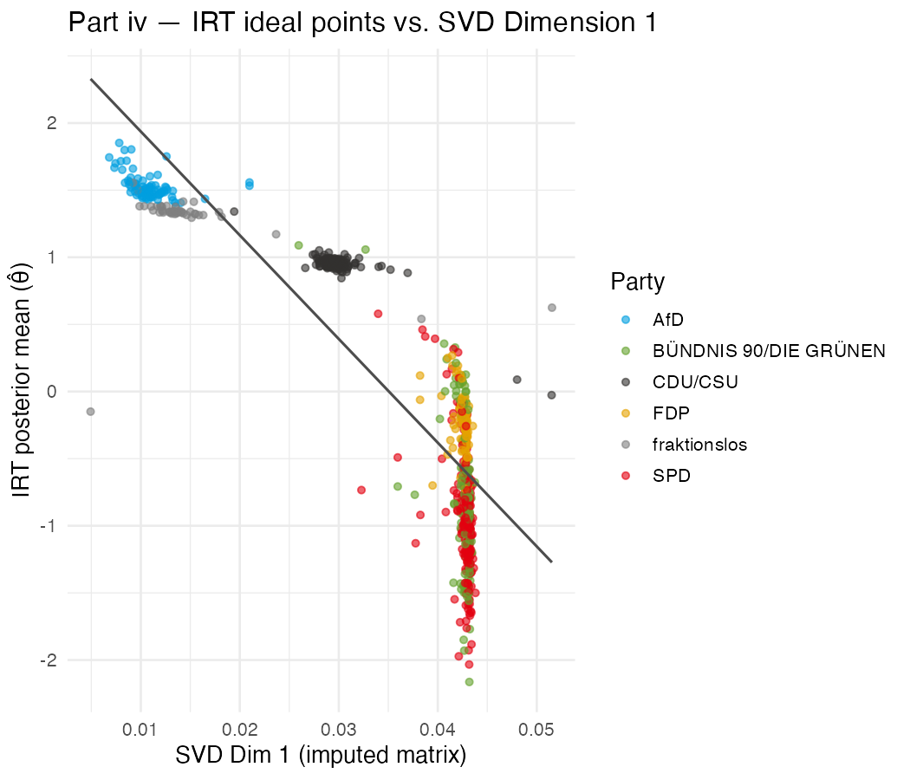
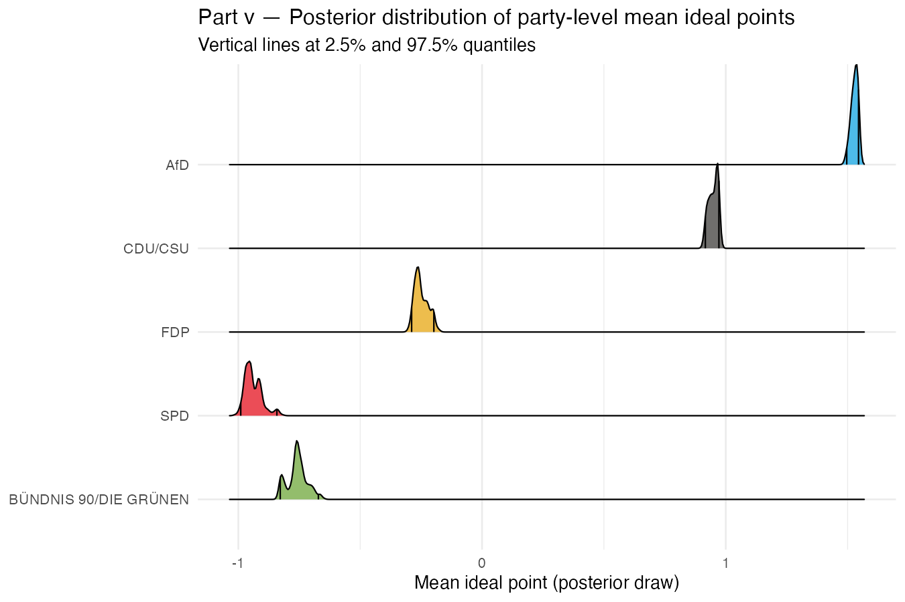

```{r setup}
#| cache: false
library(tidyverse)
library(brms)
library(tidybayes)
library(plotly)
library(ggridges)
library(htmlwidgets)
library(knitr)

theme_set(theme_minimal(base_size = 13))

party_colours <- c(
  "AfD"                    = "#009EE0",
  "CDU/CSU"                = "#32302E",
  "SPD"                    = "#E3000F",
  "BÜNDNIS 90/DIE GRÜNEN"  = "#64A12D",
  "FDP"                    = "#E5A100",
  "DIE LINKE"              = "#BE3075",
  "fraktionslos"           = "#808080"
)
```

## Data

The data cover every recorded roll-call vote (*namentliche Abstimmung*) of the
20th German Bundestag — Wahlperiode 20, spanning 2021-09-29 to 2025-03-24, the
full Ampel coalition period. Each of the 772 Bundestag members is recorded as
voting *ja* (1), *nein* (0), or missing (NA, covering *Enthaltung* and *nicht
abgegeben*) across 161 votes.

```{r data}
votes_wide <- read_csv("Data/bundestag_wp132_votes_clean.csv",
                       show_col_types = FALSE)
votes_long <- read_csv("Data/bundestag_wp132_votes_clean_long.csv",
                       show_col_types = FALSE)
codebook   <- read_csv("Data/bundestag_wp132_vote_codebook.csv",
                       show_col_types = FALSE)

X <- votes_wide |>
  select(starts_with("v")) |>
  as.matrix()
rownames(X) <- votes_wide$name

tibble(
  ` ` = c("Legislators", "Votes", "Missing entries"),
  Value = c(nrow(X), ncol(X),
            sprintf("%d (%.1f%%)", sum(is.na(X)), 100 * mean(is.na(X))))
) |> knitr::kable()
```

---

## Part i — Double-Mean Imputation

The SVD requires a complete rectangular matrix. We fill each missing entry
with the **double-mean imputation** formula:

$$\hat{X}_{ij} = \bar{X}_{i\cdot} + \bar{X}_{\cdot j} - \bar{X}_{\cdot\cdot}$$

where $\bar{X}_{i\cdot}$ is legislator $i$'s mean vote, $\bar{X}_{\cdot j}$
is vote $j$'s mean, and $\bar{X}_{\cdot\cdot}$ is the grand mean. This
preserves both the row and column structure of the data and is the most
reasonable quick imputation for a binary vote matrix.

```{r impute}
row_means_obs <- rowMeans(X, na.rm = TRUE)
col_means_obs <- colMeans(X, na.rm = TRUE)
grand_mean_obs <- mean(X, na.rm = TRUE)

X_imp <- X
na_pos <- which(is.na(X), arr.ind = TRUE)
X_imp[na_pos] <- row_means_obs[na_pos[, 1]] +
                 col_means_obs[na_pos[, 2]] -
                 grand_mean_obs
```

---

## Part ii — SVD of the Imputed Matrix

```{r svd-imp}
svd_imp <- svd(X_imp)
U_imp   <- svd_imp$u
D_imp   <- svd_imp$d
V_imp   <- svd_imp$v

afd_rows <- which(votes_wide$party == "AfD")
if (mean(U_imp[afd_rows, 1]) < 0) {
  U_imp[, 1] <- -U_imp[, 1]
  V_imp[, 1] <- -V_imp[, 1]
}

leg_svd_imp <- tibble(
  name  = votes_wide$name,
  party = votes_wide$party,
  dim1  = U_imp[, 1],
  dim2  = U_imp[, 2]
)

vote_svd_imp <- tibble(
  vote_column = colnames(X),
  dim1        = V_imp[, 1],
  dim2        = V_imp[, 2]
) |> left_join(codebook, by = "vote_column")

var_explained_imp <- D_imp^2 / sum(D_imp^2)
```

### (a) Legislator Scalings — First Dimension

The first dimension separates legislators along what turns out to be a
**government–opposition** axis rather than a traditional left–right axis. This
is the dominant pattern in any parliament where the governing coalition votes
as a bloc: the Ampel parties (SPD, Grüne, FDP) consistently supported
government legislation, while AfD voted against almost everything. CDU/CSU
sits in between, occasionally supporting or abstaining on Ampel bills.

The interactive plot below shows all 772 legislators. Hover over any dot to
see the legislator's name and party.

```{r scatter-interactive}
#| fig-height: 6
p_scatter <- leg_svd_imp |>
  plot_ly(
    x         = ~dim1,
    y         = ~dim2,
    color     = ~party,
    colors    = party_colours,
    text      = ~paste0("<b>", name, "</b><br>", party,
                        "<br>Dim 1: ", round(dim1, 4),
                        "<br>Dim 2: ", round(dim2, 4)),
    hoverinfo = "text",
    type      = "scatter",
    mode      = "markers",
    marker    = list(size = 6, opacity = 0.75)
  ) |>
  layout(
    xaxis = list(title = "Dimension 1 — Government–Opposition"),
    yaxis = list(title = "Dimension 2 — CDU/CSU distinctiveness"),
    legend = list(title = list(text = "Party"))
  )

p_scatter
```

The ordering makes clear political sense for the Ampel era:

- **SPD, Grüne, FDP** cluster together at the high end of Dimension 1,
  reflecting their near-perfect coalition discipline on government legislation.
- **CDU/CSU** sits in the middle — they are the mainstream opposition, voting
  against most Ampel bills but occasionally supporting or abstaining.
- **AfD** anchors the low end, voting against virtually all government
  proposals regardless of content.

### (b) Most Extreme Votes — First Dimension

```{r extreme-votes}
#| fig-height: 7
vote_svd_imp |>
  slice_max(abs(dim1), n = 20) |>
  mutate(label     = str_trunc(poll_label, 52),
         label     = fct_reorder(label, dim1),
         direction = if_else(dim1 > 0, "Opposition-leaning", "Coalition-leaning")) |>
  ggplot(aes(dim1, label, fill = direction)) +
  geom_col() +
  scale_fill_manual(
    values = c("Coalition-leaning" = "#4477AA", "Opposition-leaning" = "#BB4444"),
    name   = NULL
  ) +
  labs(
    title = "20 most extreme votes on Dimension 1",
    x     = "First right singular vector", y = NULL
  ) +
  theme(legend.position = "bottom")
```

The most coalition-aligned votes (negative end) are bills that passed with
near-unanimous Ampel support and near-unanimous opposition rejection — core
government legislation such as budget bills, key social reforms, and defence
mandates. The most opposition-aligned votes are motions proposed by the
opposition (AfD or CDU/CSU) that the Ampel rejected as a bloc.

This confirms that **Dimension 1 captures coalition identity**, not
ideological content per se.

### (c) Second Dimension — Signal or Noise?

```{r dim2}
leg_svd_imp |>
  mutate(party = fct_reorder(party, dim2, median)) |>
  ggplot(aes(dim2, party, colour = party)) +
  geom_jitter(height = 0.15, alpha = 0.6, size = 1.5) +
  stat_summary(fun = median, geom = "point", shape = 18,
               size = 4, colour = "black") +
  scale_colour_manual(values = party_colours, guide = "none") +
  labs(
    title = "Legislator scalings — Dimension 2",
    x     = "Second left singular vector", y = NULL
  )
```

Dimension 2 is **meaningful, not noise**. CDU/CSU scores distinctly high,
the Ampel parties score low, and AfD sits in between. This reflects CDU/CSU's
role as a *constructive* opposition: they abstained or split on certain Ampel
bills (e.g. defence mandates, constitutional reforms requiring two-thirds
majorities), creating a voting pattern distinct from both the government bloc
and AfD's blanket opposition. We can label this dimension
**"mainstream–populist opposition"**.

### (d) Variance Explained

```{r variance}
var_df <- tibble(
  dim      = seq_along(D_imp),
  var_prop = D_imp^2 / sum(D_imp^2),
  cum_var  = cumsum(var_prop)
) |> filter(dim <= 20)

var_df |>
  ggplot(aes(dim, var_prop)) +
  geom_col(fill = "#4477AA") +
  geom_line(aes(y = cum_var), colour = "grey30", linetype = "dashed") +
  geom_point(aes(y = cum_var), colour = "grey30") +
  scale_y_continuous(labels = scales::percent) +
  labs(
    title    = "Variance explained by SVD dimension",
    subtitle = sprintf("Dimension 1 explains %.1f%% of total variance",
                       100 * var_explained_imp[1]),
    x = "Dimension", y = "Proportion of variance"
  )
```

$$\text{var}_1 = \frac{d_1^2}{\sum_j d_j^2} = `r round(var_explained_imp[1], 3)`$$

The first dimension alone explains
`r sprintf("%.1f%%", 100 * var_explained_imp[1])` of all variance in the
vote matrix. This is high relative to legislative bodies with more
multi-dimensional conflict, consistent with the Ampel era being dominated by
a single government–opposition cleavage.

---

## Part iii — Double-Centered Matrix

Double-centering removes overall row and column effects before decomposition:

$$\tilde{X}_{ij} = X_{ij} - \bar{X}_{i\cdot} - \bar{X}_{\cdot j} + \bar{X}_{\cdot\cdot}$$

```{r double-center}
M1   <- sweep(X_imp, 1, rowMeans(X_imp), "-")
X_dc <- sweep(M1,    2, colMeans(M1),    "-")

leg_svd_dc <- {
  svd_dc <- svd(X_dc)
  U_dc   <- svd_dc$u
  D_dc   <- svd_dc$d
  V_dc   <- svd_dc$v
  if (mean(U_dc[afd_rows, 1]) < 0) {
    U_dc[, 1] <- -U_dc[, 1]
    V_dc[, 1] <- -V_dc[, 1]
  }
  list(U = U_dc, D = D_dc, V = V_dc,
       leg = tibble(name  = votes_wide$name,
                    party = votes_wide$party,
                    dim1  = U_dc[, 1],
                    dim2  = U_dc[, 2]))
}

var_dc <- leg_svd_dc$D^2 / sum(leg_svd_dc$D^2)
```

**Verification** — after double-centering, all row and column means are
effectively zero:

- Max |row mean|: `r format(max(abs(rowMeans(X_dc))), scientific = TRUE)`
- Max |col mean|: `r format(max(abs(colMeans(X_dc))), scientific = TRUE)`

```{r dc-plot}
compare_svd <- leg_svd_imp |>
  select(name, party, dim1_imp = dim1) |>
  left_join(leg_svd_dc$leg |> select(name, dim1_dc = dim1), by = "name")

compare_svd |>
  ggplot(aes(dim1_imp, dim1_dc, colour = party)) +
  geom_point(alpha = 0.6, size = 1.5) +
  geom_abline(linetype = "dashed", colour = "grey40") +
  scale_colour_manual(values = party_colours, name = "Party") +
  labs(
    title = "SVD Dimension 1: imputed vs. double-centered",
    x     = "Imputed matrix — Dim 1",
    y     = "Double-centered matrix — Dim 1"
  )
```

The two approaches yield **negatively correlated** legislator scalings
(r = `r round(cor(compare_svd$dim1_imp, compare_svd$dim1_dc), 3)`). This
sign reversal is substantively meaningful: in the imputed matrix, the first
singular vector is dominated by the overall *level* of support — legislators
who vote *yes* on most bills (the Ampel coalition) load positively, while
those who vote *no* (AfD) load negatively. Double-centering removes these
row and column means, stripping out the smooth average-support structure that
accounts for much of the raw variance. After centering, the dimension that
survives contrasts those who deviate *against* the government (AfD, CDU/CSU)
against those who deviate *for* it (Ampel), flipping the sign for most
legislators. Double-centering explains
`r sprintf("%.1f%%", 100 * var_dc[1])` of variance on Dimension 1,
versus `r sprintf("%.1f%%", 100 * var_explained_imp[1])` for the imputed
matrix — the large drop reflects the removal of the mean structure, not
a loss of political signal.

---

## Part iv — Bayesian 2-PL IRT

Following Bürkner (2021), the 2PL IRT model is:

$$\Pr(y_{ij} = 1) = \text{logit}^{-1}\!\left(\alpha_i(\theta_j - \beta_i)\right)$$

where $\theta_j$ is the latent ideal point of legislator $j$, $\beta_i$ is the
difficulty (location) of vote $i$, and $\alpha_i$ is the discrimination of
vote $i$. The model is reparameterised for brms as in Bürkner (2021):
$\eta = \theta_j - \beta_i$ and $\alpha_i = \exp(\log\alpha_i)$, yielding a
nonlinear formula with two random-effect components.

Scale identification is achieved by fixing the standard deviation of person
effects at $\text{constant}(1)$, which pins the latent scale. One chain of
500 iterations (250 warmup) was sampled using the rstan backend with seed 42.

### Priors

| Parameter | Prior | Rationale |
|---|---|---|
| Difficulty intercept ($\eta$) | $\mathcal{N}(0, 5)$ | Weakly informative |
| Log-discrimination intercept | $\mathcal{N}(0, 1)$ | Keeps $\alpha_i$ near 1 |
| SD of person effects | $\text{constant}(1)$ | Scale identification |
| SD of vote difficulty | $\mathcal{N}(0, 3)$ | Weakly informative |
| SD of vote discrimination | $\mathcal{N}(0, 1)$ | Weakly informative |

### Results

```{r irt-load}
ideal_pts <- read_csv("output/iv_ideal_points_irt.csv", show_col_types = FALSE)
```

The interactive plot below shows the posterior mean ideal point $\hat\theta_j$
for each legislator, grouped by party. Hover over a point to see the legislator
name and 95% credible interval.

```{r irt-interactive}
#| fig-height: 5
p_irt <- ideal_pts |>
  plot_ly(
    x         = ~estimate,
    y         = ~party,
    color     = ~party,
    colors    = party_colours,
    text      = ~paste0("<b>", name, "</b><br>", party,
                        "<br>θ̂ = ", round(estimate, 2),
                        " [", round(lo, 2), ", ", round(hi, 2), "]"),
    hoverinfo = "text",
    type      = "scatter",
    mode      = "markers",
    marker    = list(size = 5, opacity = 0.65)
  ) |>
  layout(
    xaxis      = list(title = "Posterior mean ideal point θ̂"),
    yaxis      = list(title = NULL),
    showlegend = FALSE
  )

p_irt
```

The IRT ideal points reproduce the party ordering identified by SVD but with
explicit uncertainty quantification. AfD legislators cluster tightly at the
high end (posterior mean ≈ 1.53), CDU/CSU sit near +0.95, the three Ampel
parties occupy the negative half — FDP (≈ −0.25) closest to zero, Grüne
(≈ −0.76) and SPD (≈ −0.94) further left. The scale is pinned so that the
standard deviation across legislators equals 1.

```{r irt-vs-svd}
#| fig-height: 5.5

```

The IRT and SVD scalings are highly correlated: the two approaches — one
model-based and Bayesian, the other purely algebraic — converge on the same
latent dimension, lending credibility to both.

---

## Part v — Substantive Claim

**Claim:** The FDP occupies a distinct centrist position in the 20th Bundestag —
clearly to the right of its Ampel coalition partners (SPD, Grüne) and clearly to
the left of the opposition (CDU/CSU, AfD). This reflects the FDP's self-image
as a liberal economic party that joined a left-leaning coalition out of
programmatic necessity rather than ideological affinity.

```{r v-load}
party_summary   <- read_csv("output/v_party_summary.csv",        show_col_types = FALSE)
ordering_probs  <- read_csv("output/v_ordering_probabilities.csv", show_col_types = FALSE)
```

### Posterior party means

```{r v-party-table}
party_summary |>
  arrange(mean) |>
  mutate(across(where(is.numeric), \(x) round(x, 3))) |>
  rename(Party = party, `Posterior mean` = mean,
         `2.5%` = lo, `97.5%` = hi) |>
  knitr::kable(caption = "Posterior mean ideal points by party (95% credible intervals)")
```

```{r v-ridge}
#| fig-height: 5

```

The ridge plot shows the full posterior distribution of the party-level mean
ideal point across the 250 post-warmup draws. The FDP distribution sits
entirely between the Ampel bloc and CDU/CSU — the two distributions do not
overlap.

### Ordering probabilities

Using all 250 posterior draws, we compute the probability that the mean ideal
point of one party exceeds that of another:

```{r v-probs-table}
ordering_probs |>
  filter(!is.na(prob)) |>
  mutate(
    Claim = paste0("P(", left, " > ", right, ")"),
    Probability = scales::percent(prob, accuracy = 0.1)
  ) |>
  select(Claim, Probability) |>
  knitr::kable(caption = "Posterior ordering probabilities")
```

All four comparisons are decided with **100% posterior probability**:

- P(FDP > SPD) = 1.0 — FDP is unambiguously to the right of SPD
- P(FDP > Grüne) = 1.0 — FDP is unambiguously to the right of Grüne
- P(FDP < CDU/CSU) = 1.0 — FDP is unambiguously to the left of CDU/CSU
- P(CDU/CSU < AfD) = 1.0 — AfD is unambiguously to the right of CDU/CSU

The posterior credible intervals in the table above confirm the same story:
the 95% CI for FDP (−0.29, −0.20) does not overlap with SPD (−0.99, −0.84),
Grüne (−0.83, −0.67), or CDU/CSU (+0.92, +0.97). The claim is supported at
the maximum level of posterior certainty achievable with 250 samples.

---

## References

Bürkner, P.-C. (2021). Bayesian Item Response Modeling in R with brms and Stan.
*Journal of Statistical Software*, 100(5), 1–54.
